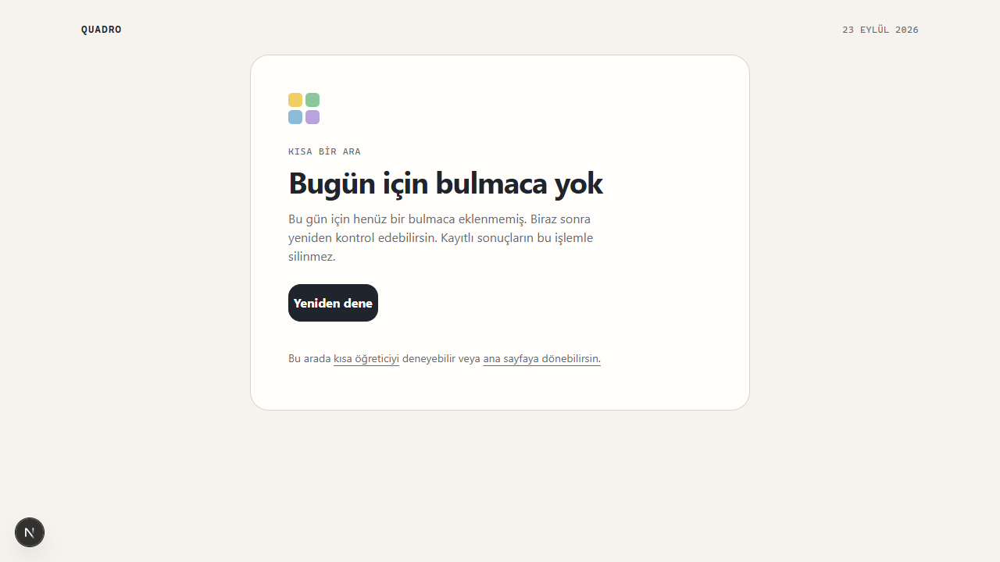
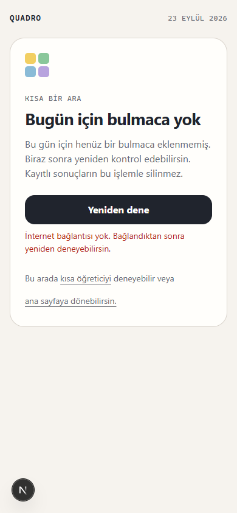
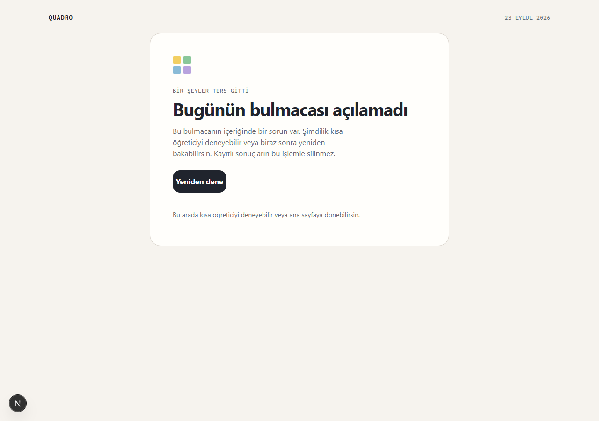
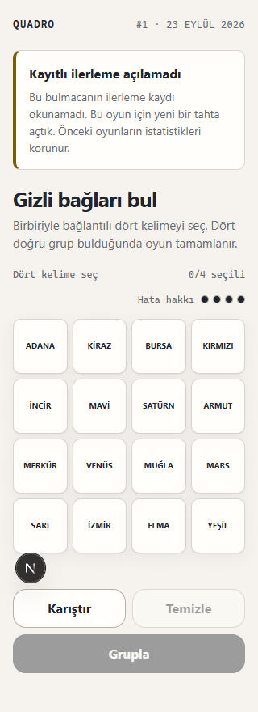
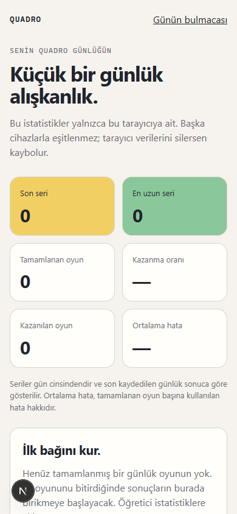
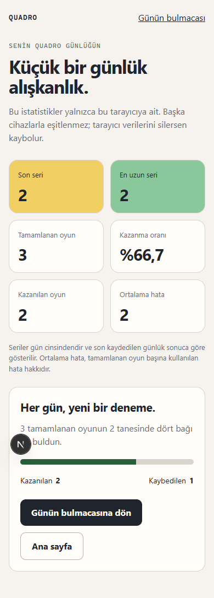
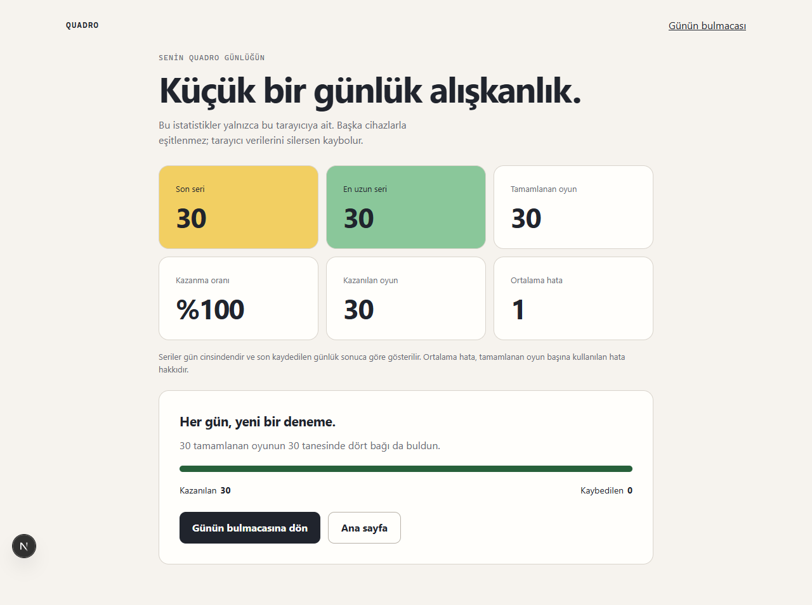

# Q24 / Q25 — Hata, kurtarma ve kişisel istatistik teslimi

Tarih: 23 Eylül 2026. Geliştirme tabanı: `a2fc8e1` (Q22 gece yarısı düzeltmesi dahil).

## Davranış

- `/play` yüklenirken ve kayıt okunurken eylemsiz 16 kartlık iskelet gösterilir.
- Eksik gün, taslak, bozuk içerik, okunamayan içerik ve beklenmedik sayfa hatası anlaşılır mesajla karşılanır. Yeniden deneme mevcut URL'yi (seçilen gün dahil) yeniden yükler; çevrimdışıyken bağlantı mesajı verir.
- Kayıt katmanının `discarded` sonucu arayüze bağlandı. Oyuncuya neden yeni tahta açıldığı açıklanır; arayüz istatistik veya oyun deposunu temizlemez.
- `/stats` mevcut `loadPersonalStats` kaynağını kullanır. Son seri, en uzun seri, tamamlanan/kazanılan oyunlar, kazanma oranı, kayıp sayısı ve ortalama hata gösterilir. Hesaplama kuralı UI içinde tekrar edilmez.
- Boş geçmişte oran ve ortalama hata için `—` gösterilir. Bozuk istatistik kurtarması ayrı açıklanır; günlük oyun kaydı korunur.
- Ana sayfa ve sonuç ekranında istatistik bağlantısı vardır. Sayfa açıkken diğer sekmenin kayıt değişikliği ve pencereye dönüş sonuçları yeniler.
- `/play/page.tsx` içindeki sayfa API'si olmayan yardımcı export kaldırıldı; yardımcı fonksiyonun davranışı aynı kaldı.

## Doğrulama

| Kontrol | Sonuç |
| --- | --- |
| Lint | Geçti; yalnız yerel `.quadro-setup`, `.playwright-cli`, `output` araç/kanıt dizinleri hariç |
| Vitest | 36 dosya, 367 test geçti |
| TypeScript | Geçti |
| Üretim derlemesi | Geçti; `/stats` rotası üretildi |
| İstemci paketi | Günlük içerik sızıntısı denetimi geçti |
| Chromium mobil | 320 ve 390 px yatay taşma yok |
| Chromium etkileşim | Çevrimdışı tekrar deneme mesajı, bozuk kayıt kurtarması ve mevcut istatistiklerin korunması doğrulandı |

Mevcut `aktif-sure.test.tsx` ana sayfa testi async bileşen/act uyarısı basıyor; testler geçiyor. Gerçek cihaz ve canlı dağıtım kabulü bu teslimin kapsamında değildir.

## Sayısal örnekler

- Boş geçmiş: 0 oyun, 0 seri; oran ve ortalama `—`.
- 1 kayıp (4 hata) + 2 ardışık kazanç (1'er hata): 3 oyun, 2 kazanç, 1 kayıp, %66,7 kazanma, 2 gün seri, ortalama 2 hata.
- 30 ardışık zamanında kazanç: 30 oyun, 30 gün seri, %100 kazanma, ortalama 1 hata.

Tarayıcı kanıtları localhost'ta kontrollü fixture içerikle ve v2 istatistik kaydıyla alındı. Gerçek yayın dosyalarının durumları değiştirilmedi. Bozuk kayıt örneği, oyun kapalıyken yalnız o günün ilerleme anahtarına geçersiz veri yazar; açıldıktan sonra önceki üç sonuç istatistik anahtarında aynen kalır.

## Görüntüler

