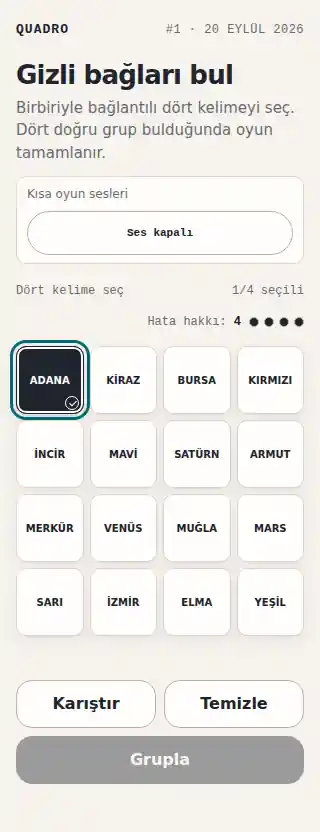
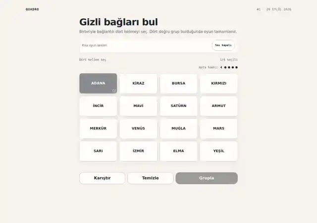
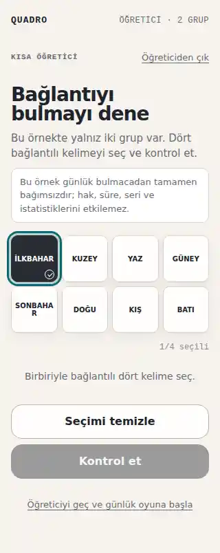

# Q32 — Mobil, klavye ve erişilebilirlik kabulü

**Tarih:** 2026-09-23  
**PR:** #84  
**Kanıt koşusu:** GitHub Actions CI #102 — run `35899852577`

## Kabul matrisi

| Kontrol | Kanıt | Sonuç |
| --- | --- | --- |
| 320 px oyun tahtası yatay taşmıyor | Chromium 320×800; `documentElement.scrollWidth <= 320` | PASS |
| Oyun kartlarının dokunma hedefi en az 44×44 CSS px | 16 kartın minimum genişlik ve yüksekliği Chromium'da ölçüldü | PASS |
| Ses tercih düğmesi en az 44×44 CSS px | Chromium'da gerçek `getBoundingClientRect()` ölçümü | PASS |
| Kartlar klavyeyle seçilebiliyor | Kart odaklandı, `Space` ile `aria-pressed="true"` oldu | PASS |
| Seçili durum yalnız renge bağlı değil | Kontrast değişimine ek olarak metinsiz CSS geometrisiyle daire + tik çiziliyor; forced-colors için ayrıca outline var | PASS |
| Seçili kartın erişilebilir adı değişmiyor | Seçim öncesi/sonrası accessible name ve kart metni aynı kaldı | PASS |
| Görünür odak var | Oyun, öğretici ve ses kontrolünde `:focus-visible` outline/box-shadow mevcut | PASS |
| Hata hakkı yalnız görsel noktalara bağlı değil | Görünür sayısal `Hata hakkı: N` + ekran okuyucu için canlı durum metni | PASS |
| Durum geri bildirimi ses/renk olmadan anlaşılır | Tahmin geri bildirimi metin olarak `role="status"` alanında; ses yalnız ek geri bildirim | PASS |
| Hareket azaltma tercihi uygulanıyor | Chromium `prefers-reduced-motion: reduce`; oyun geçiş süresi pratikte 1 ms seviyesine indirildi | PASS |
| Öğretici ekran okuyucu bağlamı taşıyor | Tahta `aria-describedby="tutorial-instructions"`; klavye seçimi 320 px'te doğrulandı | PASS |
| Uzun metinler dar ekranda anlam kaybettiren kırpma yapmıyor | Oyun, sonuç/paylaşım, öğretici ve ana sayfa metinlerinde wrap/min-width düzeltmeleri | PASS |
| Masaüstü görünümü korunuyor | Chromium 1280×900 ekran görüntüsü ve tam regresyon koşusu | PASS |
| Genel regresyon | 378/378 birim + jsdom test; production build; bundle denetimi; 17/17 gerçek Chromium testi | PASS |

## Giderilen bulgular

### 1. Generated content erişilebilir adı kirletiyordu

İlk seçili-durum denemesinde CSS `content: "✓"` kullanıldı. Gerçek Chromium erişilebilirlik ağacında bu karakter kartın adına eklenebildiği için örneğin `KIRMIZI` kartı `KIRMIZI✓` gibi algılanıyordu. Bu yaklaşım reddedildi.

### 2. `aria-hidden` çocuk metin DOM metnini değiştiriyordu

İkinci denemede `aria-hidden="true"` bir çocuk elemanda `✓` kullanıldı. Ekran okuyucu açısından gizli olsa da JSDOM `textContent` kontrollerinde kart metnine eklenerek mevcut davranış sözleşmesini bozdu. Bu yaklaşım da reddedildi.

### Nihai çözüm

Seçili göstergesi artık herhangi bir karakter veya DOM metni üretmeden iki boş CSS pseudo-elementinin border'larıyla çiziliyor. Böylece:

- görsel olarak renk dışı bir seçili işareti bulunuyor,
- `aria-pressed` semantiği korunuyor,
- erişilebilir ad değişmiyor,
- kartın `textContent` değeri değişmiyor,
- forced-colors ortamında seçili outline ayrıca korunuyor.

## Ekran görüntüleri

### 320 px — günlük oyun

### 1280 px — masaüstü

### 320 px — öğretici

## Kalan sorunlar

Q32 kabul ölçütlerini bloke eden bilinen açık sorun yoktur. Görseller ve ölçümler headless Chromium CI ortamından alınmıştır.
